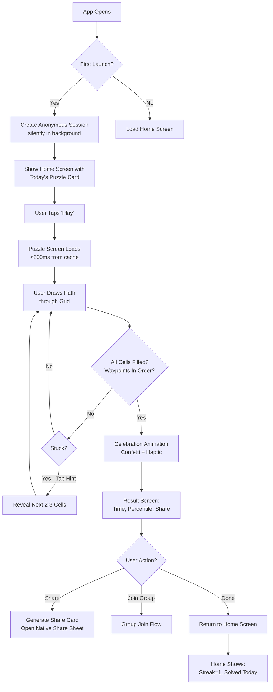
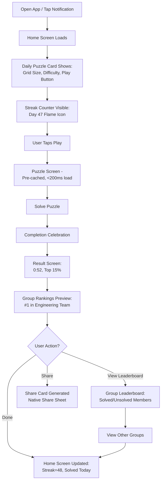
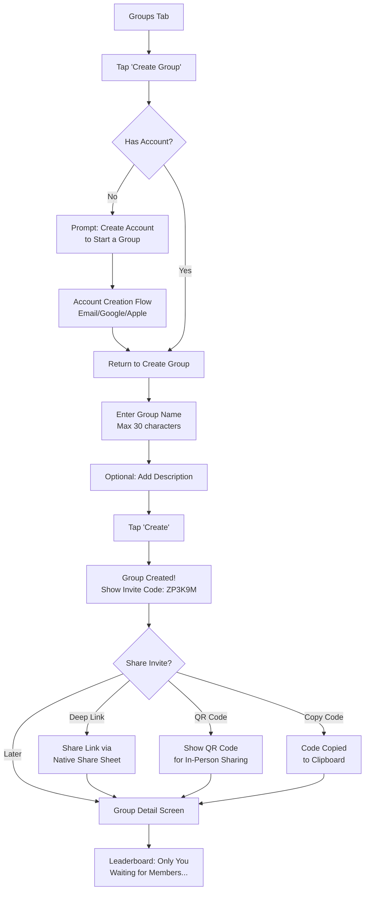
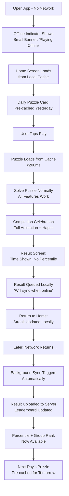
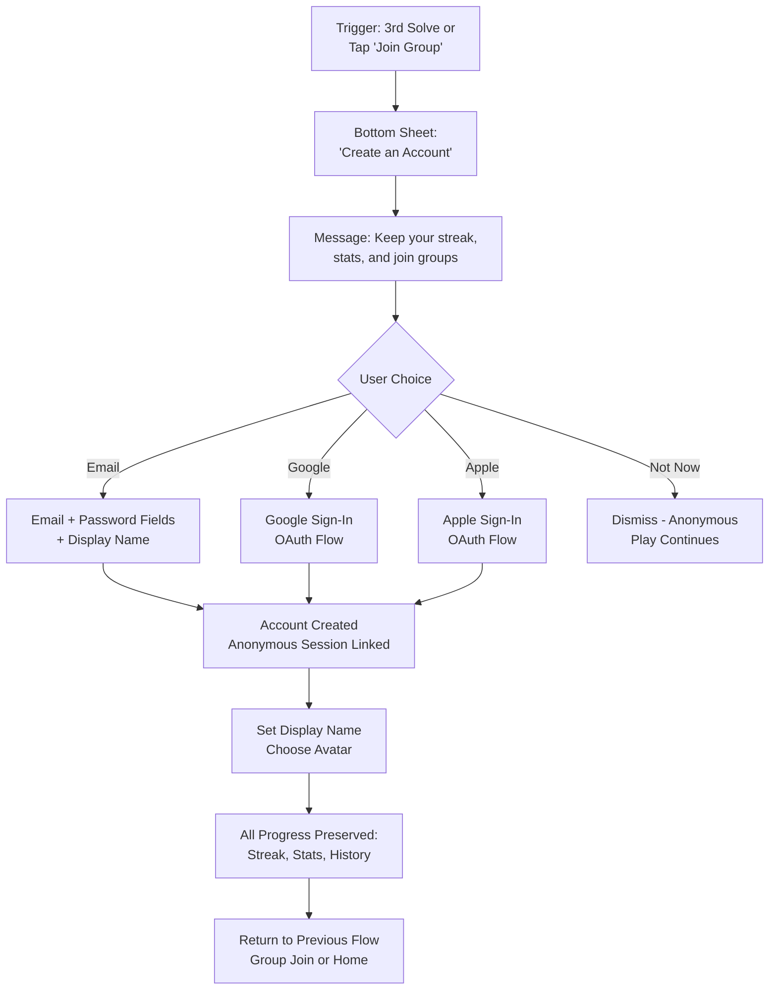

---
stepsCompleted:
  - step-01-init
  - step-02-discovery
  - step-03-core-experience
  - step-04-emotional-response
  - step-05-inspiration
  - step-06-design-system
  - step-07-defining-experience
  - step-08-visual-foundation
  - step-09-design-directions
  - step-10-user-journeys
  - step-11-component-strategy
  - step-12-ux-patterns
  - step-13-responsive-accessibility
  - step-14-complete
lastStep: 14
inputDocuments:
  - product-brief-Zip-2026-03-02.md
  - prd.md
  - PLAN.md
---

# UX Design Specification -- Icos

**Author:** Sarathfrancis
**Date:** 2026-03-02

---

## Executive Summary

### Project Vision

Icos is a cross-platform mobile puzzle game (iOS and Android, built with Flutter) where players draw a continuous path through a grid, connecting numbered waypoints in order while filling every cell. One puzzle is released daily for all users worldwide, with difficulty scaling from Monday (easy, 5x5 grid) to Sunday (hard, 8x8 grid).

The UX vision centers on delivering a **polished, delightful core loop** -- solve the daily puzzle, see your ranking in your groups, share your result -- that feels as satisfying as the best casual games while being wrapped in a social layer that transforms solo puzzling into a shared daily ritual.

Icos addresses a gap in the daily puzzle market: no standalone app combines a compelling Hamiltonian path mechanic with private group leaderboards, offline-first play, and spoiler-free social sharing. The UX must make all of this feel effortless from the very first second.

### Target Users

**Primary Persona 1 -- "Daily Puzzler Dana" (28-35, professional)**
Dana plays Wordle every morning with her coffee. She wants a quick brain challenge and the social thrill of comparing results with friends. She is not deeply technical but is comfortable with modern mobile apps. She values aesthetics, speed, and low friction. Her success moment: beating her coworker's time and sending a share card to the group chat.

**Primary Persona 2 -- "Competitive Chris" (22-40, optimizer)**
Chris tracks personal stats, optimizes solve times, and maintains long streaks. He wants detailed analytics, streak protection, and to be number one on multiple group leaderboards. He is tech-savvy, values performance and data, and will notice if the path drawing stutters. His success moment: maintaining a 47-day streak and holding the top rank in two groups.

**Primary Persona 3 -- "Social Sam" (25-45, organizer)**
Sam creates and manages groups for coworkers and friend circles. She wants frictionless group creation, easy invite sharing, and tools to manage members. She values community and daily rituals. Her success moment: her 12-person office team all competing on the daily leaderboard.

**Secondary -- Casual Discoverers**
People who receive a share card or group invite and try the game for the first time. They need zero-friction entry (anonymous play, no sign-up wall) and an immediate, intuitive experience.

### Key Design Challenges

1. **Touch-based path drawing must feel flawless** -- This is the core interaction. Any lag, imprecision, or visual glitch breaks the entire experience. The path drawing must render at 60 FPS minimum with smooth gesture tracking, intuitive backtracking, and clear feedback.

2. **Balancing information density on mobile** -- The puzzle grid needs maximum screen real estate, but players also need access to hints, undo/redo, and navigation. The game screen must be minimal chrome during play with easy access to tools.

3. **Social features without friction** -- Group creation, joining, and leaderboard viewing must feel lightweight and instant. Players should never feel like social features are a separate app bolted on.

4. **Offline-first without confusion** -- Players must never wonder if their data is synced. The offline/online transition must be invisible, with clear indicators only when connectivity is absent.

5. **Onboarding without onboarding** -- The puzzle mechanic is intuitive enough that players should be able to start playing within seconds of opening the app, without a tutorial gate. The UI must teach through progressive disclosure and affordances, not instructions.

### Design Opportunities

1. **Haptic feedback as a language** -- Different haptic patterns for cell entry, waypoint reached, wall collision, and completion can create a tactile vocabulary that makes the game feel physical and satisfying.

2. **Celebration as retention** -- The completion moment (confetti, stats reveal, group ranking preview) is the peak emotional moment. Investing in this animation creates screenshots, shares, and return visits.

3. **Spoiler-free sharing as viral mechanic** -- The abstract path visualization on share cards creates intrigue without spoiling the puzzle, driving new user acquisition through curiosity.

4. **Group dynamics as retention engine** -- "You're the last one! 9/10 members have solved today" notifications and visible unsolved states on the leaderboard create gentle social pressure that drives daily engagement.

---

## Core User Experience

### Defining Experience

Icos's defining experience is: **"Draw a path through the grid, connecting the numbers, filling every cell."**

This is the Tinder-swipe-equivalent for Icos -- the core interaction that players will describe to friends and that must feel perfect. The finger-on-glass path drawing, with its smooth blue trail, haptic pulses at each waypoint, and satisfying grid-fill completion, is the entire product in one gesture.

If path drawing feels fluid, responsive, and tactile, everything else follows. If it stutters, lags, or feels imprecise, nothing else matters.

### User Mental Model

Players approach Icos with mental models drawn from:
- **Maze/path puzzles** -- The concept of drawing a continuous route is intuitive to anyone who has done a maze
- **Wordle/daily puzzle games** -- The "one puzzle per day, same for everyone" ritual is now a well-established pattern
- **Touch-based drawing** -- The expectation is immediate, direct manipulation: where my finger goes, the path follows

Players expect the path to follow their finger in real-time with zero perceptible latency. They expect dragging backward to undo. They expect the grid to be the primary focus with minimal UI chrome.

Where users may get confused:
- Understanding they must visit ALL cells, not just waypoints (solved by visual feedback: empty cells are clearly distinct from filled cells)
- Understanding wall barriers prevent movement between specific adjacent cells (solved by thick, visually distinct wall lines)
- Not realizing they can undo by dragging backward (solved by smooth visual feedback when backtracking)

### Success Criteria

| Criteria | Target | Measurement |
|----------|--------|-------------|
| First puzzle completion | Within 90 seconds of app open | Analytics timestamp |
| Path drawing frame rate | 60 FPS minimum on 2022+ devices | Frame timing profiler |
| Path input latency | < 16ms finger-to-pixel | Touch event timing |
| Puzzle load from cache | < 200ms | Analytics event |
| Zero-friction entry | Play without account creation | Anonymous auth flow |
| Core loop completion | Solve -> See rank -> Share in under 3 minutes | Session analytics |

### Novel UX Patterns

Icos combines established patterns in a novel way:

**Established patterns adopted:**
- Bottom tab navigation (Home, Groups, Stats, Profile)
- Card-based home screen layout
- Pull-to-refresh for leaderboards
- Native share sheet integration
- Streak counters with visual fire/flame indicators

**Novel patterns designed:**
- **Drag-to-draw path with drag-backward-to-undo** -- While path drawing exists in puzzle games, the seamless undo-by-backtracking gesture (without needing to hit an undo button) is a differentiated interaction
- **Spoiler-free share cards** -- Abstract grid visualization that shows performance without revealing the solution path; a novel sharing format specific to path puzzles
- **Solved/unsolved member states on leaderboard** -- Showing which group members have and have not solved (without revealing details until the viewer solves) creates social anticipation without spoilers

### Experience Mechanics

**1. Initiation:**
- App opens to Home screen with today's puzzle card prominently displayed
- Large "Play" button on the daily puzzle card invites immediate action
- For first-time users, the puzzle screen loads directly (anonymous auth happens silently in the background)

**2. Interaction:**
- Player touches any cell to begin the path (or the starting waypoint "1")
- Dragging finger across adjacent cells draws the path with smooth blue fill and subtle glow
- Each cell entered triggers a light haptic tap
- Reaching a numbered waypoint triggers a medium haptic pulse and the circle animates (pulse + glow ring)
- Hitting a wall triggers an error haptic buzz and brief red flash; the path does not cross
- Dragging backward along the existing path erases segments with a smooth fade-out animation
- Tapping a cell on the drawn path removes everything from that cell to the end
- Undo/redo buttons and reset button available in minimal toolbar

**3. Feedback:**
- Path cells fill with vibrant blue (#3B82F6) with a subtle glow trail
- Empty cells remain visually distinct (dark navy #141830 in dark mode, white in light mode)
- Waypoint circles pulse coral-orange (#FF6B35) when reached
- Progress is visually obvious: the ratio of filled to empty cells shows how close to completion
- Wall collisions provide immediate negative feedback (error haptic + red flash) so the player knows to try a different route

**4. Completion:**
- When all cells are filled and all waypoints visited in order, the puzzle completes automatically
- Celebration animation: grid cells ripple outward, confetti burst (800ms total, Rive animation)
- Success haptic pattern plays
- Solve time appears in large monospace text (was hidden during play to reduce anxiety)
- Percentile comparison: "Faster than 73% of players today"
- Group ranking preview: "You're #2 in 'Engineering Team'"
- Share and leaderboard buttons prominently displayed

---

## Desired Emotional Response

### Primary Emotional Goals

| Moment | Desired Emotion | Design Approach |
|--------|----------------|-----------------|
| App open | **Anticipation, excitement** | Daily puzzle card with fresh difficulty indicator; streak counter visible |
| During puzzle | **Focus, flow state** | Minimal chrome, hidden timer, smooth haptics, no interruptions |
| Waypoint reached | **Micro-satisfaction** | Haptic pulse + visual glow creates small reward moments throughout the solve |
| Stuck / backtracking | **Curiosity, not frustration** | Smooth undo, available hints, no penalty for exploration |
| Puzzle completion | **Triumph, delight** | Celebration animation, time reveal, percentile ranking, group position |
| Viewing leaderboard | **Competitive pride or friendly motivation** | Clear ranking, avatars, visible member states |
| Sharing result | **Social connection, bragging** | Beautiful share card design, easy one-tap sharing |
| Returning next day | **Ritual comfort, streak motivation** | Streak display, "new puzzle ready" notification |

### Emotional Journey Mapping

**Discovery phase (Day 1):**
Curiosity -> Immediate engagement (no signup wall) -> Mild challenge -> Satisfaction at completion -> Surprise at social features -> Desire to share/compare

**Habit formation phase (Days 2-7):**
Anticipation (new puzzle) -> Comfortable familiarity -> Growing confidence -> Competitive drive (group rankings) -> Streak awareness -> Fear of breaking streak

**Loyalty phase (Week 2+):**
Daily ritual comfort -> Mastery feeling (improving times) -> Social belonging (group identity) -> Pride in streak -> Evangelist behavior (inviting others)

### Micro-Emotions

**Confidence over confusion:**
- The grid should always feel readable and approachable. Waypoint numbers are large and clear. Walls are thick and distinct. The player should never wonder "can I move there?"
- Progressive difficulty (Monday=easy through Sunday=hard) builds confidence before introducing challenge.

**Accomplishment over frustration:**
- The hint system (3 per day, reveals next 2-3 cells) provides a safety net so players never feel permanently stuck
- Undo is effortless (drag backward) so mistakes feel recoverable, not punishing
- The timer is hidden during play to eliminate time pressure anxiety

**Delight over mere satisfaction:**
- Haptic feedback transforms a visual experience into a tactile one
- The completion celebration is intentionally over-the-top (confetti, ripple, success haptic) to create a peak moment
- Percentile ranking ("Faster than 73%") provides context that makes any solve time feel like an achievement

**Belonging over isolation:**
- Group leaderboards transform solo puzzling into a shared experience
- "9/10 members have solved today" creates gentle social inclusion
- Spoiler-free sharing enables conversation without ruining the puzzle for others

### Design Implications

- **Flow state protection:** The puzzle screen must eliminate all distractions. No ads, no popups, no visible timer, minimal UI chrome. The player should enter a flow state and stay in it.
- **Reward layering:** Completion rewards stack: haptic -> animation -> time reveal -> percentile -> group rank -> share opportunity. Each layer adds a micro-moment of delight.
- **Social warmth without pressure:** Group features should feel inviting, not demanding. Notifications are opt-in per group. Unsolved states show "Waiting for [Name]..." rather than shaming language.
- **Streak protection as anxiety reduction:** The streak freeze (1 per week, auto-applied) prevents the worst emotional moment in daily games: losing a long streak to a missed day. This protects the player's emotional investment.

### Emotional Design Principles

1. **Respect the player's time.** One puzzle per day, solvable in 30 seconds to 5 minutes. No grinding, no gacha, no dark patterns.
2. **Make every touch feel deliberate.** Haptic feedback + visual response on every interaction. The player should feel the game responding to them.
3. **Celebrate generously.** The completion moment is the product's peak. Over-invest in making it feel special.
4. **Social without obligation.** Groups and sharing are available and attractive, but never forced. Solo play is a complete experience.
5. **Build confidence through progression.** Monday puzzles are easy wins. The week builds difficulty gradually so players feel their skills growing.

---

## UX Pattern Analysis & Inspiration

### Inspiring Products Analysis

**1. Wordle (NYT)**
- **What it does well:** One puzzle per day creates scarcity and ritual. The share grid (colored squares) went viral because it conveys results without spoilers. The interface is brutally simple: type a word, see colors.
- **Key UX lesson for Icos:** Constrain the experience to create habit. The daily limit is a feature, not a limitation. The share card format must be similarly iconic and non-spoiling.
- **What it lacks:** No group leaderboards, no private competition, no streaks with freeze protection. The social layer is external (screenshots in group chats).

**2. LinkedIn Zip**
- **What it does well:** Proved the Hamiltonian path mechanic works on mobile. Smooth path drawing. Clean grid presentation. Daily puzzle cadence.
- **Key UX lesson for Icos:** The core mechanic is validated. Players understand and enjoy drawing paths through numbered waypoints. Grid visualization with numbered circles and walls works.
- **What it lacks:** Locked inside LinkedIn. No group leaderboards. No offline play. No dedicated social features. Limited statistics. No spoiler-free sharing.

**3. Duolingo**
- **What it does well:** Streak mechanic with freeze protection drives daily retention. The streak freeze is a psychological safety net that reduces streak anxiety. Celebration animations are generous and motivating. The notifications are persistent but effective ("Duo is sad").
- **Key UX lesson for Icos:** Streak freeze is essential for retention. Celebration should be immediate and enthusiastic. Progress visualization (streak counter, daily tracker) should be prominent on the home screen.

**4. Strava (Social Fitness)**
- **What it does well:** Private groups with activity feeds and leaderboards. The "Segment Leaderboard" pattern where everyone competes on the same route maps perfectly to "same puzzle, different solve times." Social comparison is motivating without being toxic because the groups are private and self-selected.
- **Key UX lesson for Icos:** Private group leaderboards work best when groups are self-organized. The group invite flow must be frictionless (link + code). Leaderboard display should highlight personal position clearly.

### Transferable UX Patterns

**Navigation Patterns:**
- **Bottom tab bar** (Instagram, Duolingo) -- Proven pattern for 4-5 primary destinations on mobile. Works perfectly for Home / Groups / Stats / Profile.
- **Card-based home screen** (Wordle, NYT Games) -- Daily puzzle as a prominent card with action button. Supporting cards for groups and streak.

**Interaction Patterns:**
- **Direct manipulation drawing** (drawing apps, LinkedIn Zip) -- Finger position directly controls the path. No indirect controls needed for the core action.
- **Drag-to-undo** (similar to path erasing in drawing apps) -- Reversing the gesture reverses the action. Intuitive and efficient.
- **Pull-to-refresh** (universal mobile pattern) -- For leaderboard updates and group activity.

**Feedback Patterns:**
- **Haptic vocabulary** (Apple system haptics) -- Light/medium/heavy/error patterns create an invisible language. Cell entry = light, waypoint = medium, wall = error, completion = success.
- **Wordle share grid** -- Abstract visual that communicates result without revealing solution. Icos's version shows a grid silhouette with colored blocks representing the general path shape.

**Emotional Patterns:**
- **Duolingo streak flame** -- Prominent streak counter with fire/flame icon on the home screen. Visual urgency when streak is at risk.
- **Confetti celebration** (many apps) -- Brief, enthusiastic celebration animation on achievement. Creates a screenshot moment.

### Anti-Patterns to Avoid

1. **Interstitial ads between puzzles** -- Breaks flow state and cheapens the experience. Icos is ad-free.
2. **Mandatory tutorial before first play** -- Creates friction at the highest-intent moment. Players should play immediately; progressive hints can teach.
3. **Visible countdown timer during play** -- Creates anxiety and discourages exploration. Time is tracked silently and revealed on completion.
4. **Forced social login** -- Anonymous play must be the default. Account creation should be prompted gently (after 3rd solve or group join attempt), never required.
5. **Aggressive push notifications** -- Notifications must be opt-in per group with granular controls. "Your streak is about to end!" once per day maximum; never "We miss you!" spam.
6. **Complex group management UI** -- Group creation should be 2 taps (name + create). Joining should be 1 tap (from deep link). Over-engineering group admin tools kills adoption.
7. **Leaderboard shame** -- Never highlight "last place" or use negative language. "Waiting for [Name] to solve..." is warm; "#12 of 12" with a red indicator is not.

### Design Inspiration Strategy

**Adopt directly:**
- Bottom tab navigation with 4 tabs
- Card-based home screen with daily puzzle as hero card
- Streak counter with fire icon on home screen
- Native share sheet for result sharing
- Pull-to-refresh for leaderboard data

**Adapt for Icos:**
- Wordle share grid -> Icos share card with abstract path visualization + time + grid size
- Duolingo streak freeze -> Icos streak freeze with 1/week auto-application
- Strava segment leaderboard -> Icos group daily/weekly leaderboard with solved/unsolved member states
- LinkedIn Zip grid rendering -> Enhanced with glow trail, haptic vocabulary, wall collision feedback

**Avoid entirely:**
- Ad interruptions (Wordle pre-NYT had none; post-NYT has subscription gate)
- Complex onboarding flows
- Gamification bloat (badges, levels, currencies -- keep it focused on streak + group rank for MVP)

---

## Design System Foundation

### Design System Choice

Icos uses a **custom design system built on Flutter's Material 3 foundation**, themed with a custom visual identity. This is a hybrid approach:

- **Foundation:** Flutter's Material 3 widgets provide the structural foundation (AppBar, BottomNavigationBar, Card, ListTile, Dialog, SnackBar, etc.) with built-in accessibility, gesture handling, and platform adaptation.
- **Custom layer:** The puzzle grid, path drawing, celebration animations, share card renderer, and leaderboard components are fully custom (built with CustomPainter + Canvas API).
- **Theming:** Material 3's dynamic theming system is used to apply Icos's custom color palette, typography, and shape system globally.

### Rationale for Selection

1. **Flutter-native:** Material 3 is Flutter's first-class design system with deep integration. Using it eliminates fighting the framework.
2. **Accessibility built in:** Material 3 widgets include proper semantics, touch targets (48dp default), and high contrast support out of the box.
3. **Custom where it matters:** The puzzle engine (grid, path, animations) requires custom rendering that no design system provides. Material 3 handles everything around the puzzle (navigation, settings, lists, dialogs) while the game canvas is fully custom.
4. **Theming flexibility:** Material 3's ColorScheme, TextTheme, and ShapeTheme systems allow Icos's unique visual identity to be applied consistently across all Material widgets.
5. **Single developer efficiency:** As a solo developer project, leveraging proven Material 3 components for standard UI reduces development time while focusing custom effort on the core gameplay experience.

### Implementation Approach

- Use `ThemeData` with custom `ColorScheme` to apply Icos colors globally
- Create a `IcosTheme` extension for game-specific tokens (grid colors, path glow, waypoint accent, wall color)
- Build puzzle-specific widgets (grid, path canvas, result card, share card) as custom Flutter widgets using `CustomPainter`
- Use Material 3 widgets for all non-game UI: navigation, settings, dialogs, lists, forms
- Implement dark mode and light mode as complete `ThemeData` variants with mode-specific game canvas colors

### Customization Strategy

The customization strategy separates concerns:

| Layer | Approach | Examples |
|-------|----------|---------|
| **App shell** | Material 3 themed | Bottom nav, AppBar, cards, dialogs, buttons, text fields |
| **Game canvas** | Fully custom | Grid rendering, path drawing, waypoint circles, wall barriers, celebration animation |
| **Shared components** | Custom widgets using Material tokens | Streak counter, leaderboard list items, share card, group invite card, stats charts |
| **Design tokens** | Central theme file | Colors, typography, spacing, corner radii, animation durations, haptic patterns |

---

## 2. Core User Experience

### 2.1 Defining Experience

**"Draw a continuous path through the grid, connecting the numbered waypoints in order, filling every cell."**

This single sentence encapsulates the entire product. The defining interaction is the moment a player's finger touches the grid and begins drawing: the smooth blue trail follows their finger, cells fill in sequence, haptic taps pulse rhythmically, and the grid gradually transforms from empty to solved.

Like Tinder's swipe or Instagram's double-tap, Icos's path drawing must feel iconic -- recognizable, satisfying, and effortless. This is what players will describe to friends: "You draw a path through a grid and connect the numbers."

### 2.2 User Mental Model

**How players think about the puzzle:**
- "I need to connect the numbers in order" (primary goal)
- "I need to fill every cell" (secondary constraint that creates the challenge)
- "I can't cross walls" (barrier awareness)
- "If I get stuck, I can backtrack" (undo awareness)

**Mental model from existing products:**
- Drawing/painting apps: "Where my finger goes, the mark follows"
- Maze puzzles: "Find the path from start to end"
- Wordle: "One puzzle per day, same for everyone, share my result"

**Key insight:** The path drawing mental model is a direct manipulation model. Players expect zero abstraction between their finger movement and the path on screen. Any latency or indirection (e.g., tap-to-fill instead of drag-to-draw) would break the mental model.

### 2.3 Success Criteria

The core experience succeeds when:
1. A player can pick up the game and complete their first puzzle without any instruction
2. The path feels like it is attached to the player's finger, not lagging behind
3. The player can recover from wrong paths without frustration (undo is as natural as drawing)
4. The completion celebration creates an emotional peak that makes the player want to share and return
5. The entire solve-to-share loop takes under 3 minutes for a medium puzzle

### 2.4 Novel UX Patterns

**Path drawing with integrated undo:**
Unlike typical puzzle games where undo is a separate button action, Icos's primary undo mechanism is dragging backward along the drawn path. The path visually erases in reverse as the finger retraces. This is novel because it keeps the player in the direct manipulation mental model -- the same gesture (dragging) both creates and destroys the path.

**Hidden timer with post-reveal:**
The timer runs silently during play and is only revealed on completion. This is intentionally counter to most puzzle games that show a running timer. The design rationale: a visible timer creates performance anxiety that conflicts with the flow state we want during solving. The time reveal on completion creates a surprise moment ("Oh, that was fast!") rather than mounting pressure.

**Spoiler-free abstract path visualization:**
The share card shows the grid outline with colored blocks indicating the general shape/direction of the path, without showing the exact cell-by-cell solution. This is a novel visual encoding that communicates effort and personality without enabling cheating.

### 2.5 Experience Mechanics

#### Grid Interaction Model

```
TOUCH STATES
------------
Idle         -> Grid displayed, ready for input
Drawing      -> Finger down, dragging through cells, path extending
Backtracking -> Finger dragging backward on existing path, cells clearing
Paused       -> Finger lifted, path preserved, can resume from path end
Complete     -> All cells filled, all waypoints in order, celebration triggers
```

#### Gesture Priority (Highest to Lowest)

1. **Path drawing (drag)** -- Always captured when finger is on the grid
2. **Path backtrack (drag backward)** -- When finger moves to previously drawn cell
3. **Tap on path cell** -- Removes path from that cell to end
4. **Undo button tap** -- Removes last path segment
5. **Redo button tap** -- Restores last undone segment
6. **Hint button tap** -- Reveals next 2-3 correct cells
7. **Reset button tap** -- Clears entire path (with confirmation)
8. **System back gesture** -- Exits puzzle (with "are you sure?" if in progress)

#### Cell State Machine

```
CELL STATES
-----------
Empty        -> Default state, no path, available for drawing
Filled       -> Part of the drawn path, shows path color
Waypoint     -> Contains a numbered waypoint circle; can be Empty or Filled
Wall-blocked -> Adjacent cell is separated by a wall barrier (directional)
Current      -> The cell where the path currently ends (highlighted)
```

#### Feedback Matrix

| User Action | Visual Feedback | Haptic Feedback | Audio (if enabled) |
|-------------|----------------|-----------------|-------------------|
| Finger enters empty cell | Cell fills with blue (#3B82F6) + subtle glow | Light tap (UIImpactFeedbackGenerator.light) | Soft tick |
| Finger reaches waypoint | Waypoint circle pulses + glow ring (200ms) | Medium impact | Chime note |
| Finger hits wall | Path bounces, cell flashes red (150ms) | Error buzz (UINotificationFeedbackGenerator.error) | Dull thud |
| Finger backtracks | Cell fades out path color in reverse (100ms) | Light tap | Reverse tick |
| Tap undo button | Last segment fades out | Light tap | Reverse tick |
| Tap redo button | Segment fades back in | Light tap | Soft tick |
| Use hint | Next 2-3 cells glow, then fill with hint indicator | Medium impact | Discovery chime |
| Puzzle complete | Grid ripple + confetti burst (800ms) | Success pattern (3-beat) | Victory fanfare |
| Reset puzzle | All cells fade to empty simultaneously | None | Whoosh |

---

## Visual Design Foundation

### Color System

#### Dark Mode (Primary)

| Token | Hex | Usage |
|-------|-----|-------|
| `background.primary` | `#0A1628` | Deep navy -- main background |
| `background.secondary` | `#141830` | Grid cells, card backgrounds |
| `background.elevated` | `#1E2444` | Elevated surfaces, modals |
| `surface.grid` | `#141830` | Empty grid cells |
| `surface.gridLines` | `#2A3050` | Grid line borders |
| `path.primary` | `#3B82F6` | Electric blue -- drawn path |
| `path.glow` | `#3B82F6` at 30% | Path glow effect |
| `path.current` | `#60A5FA` | Current cell highlight (lighter blue) |
| `waypoint.fill` | `#FF6B35` | Coral-orange waypoint circles |
| `waypoint.reached` | `#FF8F65` | Waypoint reached state (lighter) |
| `waypoint.text` | `#FFFFFF` | Waypoint numbers |
| `wall.primary` | `#FF4444` at 80% | Wall barriers between cells |
| `success` | `#10B981` | Success green -- completion, positive states |
| `streak` | `#F59E0B` | Amber -- streak fire, streak counter |
| `error` | `#EF4444` | Error red -- validation, destructive actions |
| `warning` | `#F59E0B` | Warning amber |
| `text.primary` | `#F8FAFC` | Primary text (near-white) |
| `text.secondary` | `#94A3B8` | Secondary text (muted slate) |
| `text.tertiary` | `#64748B` | Tertiary text (dim) |
| `hint.indicator` | `#A78BFA` | Purple -- hint cells, hint button |

#### Light Mode

| Token | Hex | Usage |
|-------|-----|-------|
| `background.primary` | `#F5F6FA` | Soft off-white -- main background |
| `background.secondary` | `#FFFFFF` | Grid cells, card backgrounds |
| `background.elevated` | `#FFFFFF` | Elevated surfaces with shadow |
| `surface.grid` | `#FFFFFF` | Empty grid cells |
| `surface.gridLines` | `#D0D4E0` | Grid line borders |
| `path.primary` | `#3B82F6` | Electric blue -- drawn path (same in both modes) |
| `path.glow` | `#3B82F6` at 20% | Path glow (slightly less intense in light mode) |
| `waypoint.fill` | `#FF6B35` | Coral-orange (same in both modes) |
| `waypoint.text` | `#1A1E30` | Waypoint numbers (dark on light) |
| `wall.primary` | `#1E293B` | Dark walls on light background |
| `text.primary` | `#0F172A` | Primary text (near-black) |
| `text.secondary` | `#475569` | Secondary text |
| `text.tertiary` | `#94A3B8` | Tertiary text |

#### Semantic Color Mapping

```
Primary Action:     path.primary (#3B82F6)  -- buttons, links, active states
Secondary Action:   text.secondary           -- secondary buttons, less emphasis
Destructive:        error (#EF4444)          -- delete, leave group, reset
Success:            success (#10B981)        -- completion, positive feedback
Warning:            warning (#F59E0B)        -- streak at risk, approaching limits
Accent:             waypoint.fill (#FF6B35)  -- waypoints, premium features, highlights
Hint:               hint.indicator (#A78BFA) -- hint usage, hint cells
```

#### Accessibility Compliance

All color pairings meet WCAG 2.1 AA contrast requirements:
- `text.primary` on `background.primary`: 15.3:1 (dark), 16.1:1 (light) -- exceeds AAA
- `text.secondary` on `background.primary`: 5.8:1 (dark), 5.2:1 (light) -- meets AA
- `waypoint.text` on `waypoint.fill`: 4.6:1 -- meets AA
- `path.primary` on `surface.grid`: 4.8:1 (dark), 4.5:1 (light) -- meets AA
- All interactive elements meet 3:1 minimum for non-text contrast

### Typography System

```
FONT STACK
----------
Primary:        Inter (with system fallback: -apple-system, Roboto)
Monospace:      JetBrains Mono (for timer, solve times, grid numbers)

TYPE SCALE (using 4px base unit)
--------------------------------
Display Large:  JetBrains Mono, 40sp, Bold   -- Solve time on result screen
Display Medium: Inter, 28sp, Bold             -- Screen titles
Heading Large:  Inter, 24sp, SemiBold         -- Section headers
Heading Medium: Inter, 20sp, SemiBold         -- Card titles, group names
Body Large:     Inter, 16sp, Regular          -- Primary body text
Body Medium:    Inter, 14sp, Regular          -- Secondary text, descriptions
Body Small:     Inter, 12sp, Regular          -- Captions, timestamps, hints
Label Large:    Inter, 14sp, SemiBold         -- Button text, tab labels
Label Medium:   Inter, 12sp, SemiBold         -- Badges, tags, small buttons
Grid Number:    JetBrains Mono, adaptive*     -- Waypoint numbers on grid

* Grid numbers scale based on cell size:
  5x5 grid -> 20sp
  6x6 grid -> 18sp
  7x7 grid -> 16sp
  8x8 grid -> 14sp

LINE HEIGHTS
------------
Display:    1.1 (tight for large numerals)
Heading:    1.3 (comfortable for titles)
Body:       1.5 (optimal readability)
Label:      1.2 (compact for buttons/tags)
```

### Spacing & Layout Foundation

```
SPACING SCALE (8px base unit)
-----------------------------
2xs:    2px   -- Hairline borders, minimal gaps
xs:     4px   -- Icon-to-text gap, tight element spacing
sm:     8px   -- Compact padding, list item internal
md:     12px  -- Standard padding, card internal
lg:     16px  -- Section spacing, card padding
xl:     24px  -- Grid padding, section gaps
2xl:    32px  -- Screen-level spacing
3xl:    48px  -- Major section separation

CORNER RADII
-------------
none:   0px   -- Grid cells (sharp for puzzle clarity)
sm:     4px   -- Small buttons, badges, tags
md:     8px   -- Cards, input fields, grid cell overlays
lg:     12px  -- Modal dialogs, bottom sheets
xl:     16px  -- Navigation bar items, large cards
full:   9999px -- Circular elements (avatars, waypoint circles, FABs)

GRID SIZING
-----------
Grid padding:         24px on each side (horizontal)
Grid top margin:      16px below toolbar
Grid bottom margin:   16px above action bar
Cell size:            (screen_width - 48px) / grid_columns
Cell gap:             2px (hairline between cells)
Min touch target:     44x44dp (Apple HIG / Material guidelines)

SCREEN LAYOUT
-------------
Safe area insets:     Respected on all screens (notch, home indicator)
Bottom nav height:    56dp + safe area bottom
Toolbar height:       56dp + safe area top
Content area:         Full remaining height between toolbar and nav/action bar
```

### Accessibility Considerations

- **Color is never the sole indicator:** Colorblind mode adds crosshatch patterns to path cells, dot patterns to waypoint circles, and dash patterns to walls, so all game states are distinguishable without color
- **Touch targets:** All interactive elements are minimum 44x44dp (applies to undo/redo buttons, hint button, navigation items, settings toggles)
- **Reduced motion:** When system reduced motion is enabled, all animations are replaced with simple fade transitions (celebration becomes a gentle glow instead of confetti, path drawing skips the glow trail)
- **Screen reader support (post-MVP):** Grid cells are labeled with position and state ("Row 3, Column 4, empty" or "Row 3, Column 4, waypoint 5, filled"). Navigation between cells uses swipe gestures.
- **Dynamic type:** All text respects system font size preferences up to 200% scaling. Grid numbers have a minimum readable size enforced.
- **High contrast mode:** When system high contrast is enabled, grid lines become thicker, path color becomes fully opaque, and backgrounds increase contrast.

---

## Design Direction Decision

### Design Directions Explored

The design direction for Icos follows a **"Dark Immersive Game" aesthetic** -- a deep navy background that makes the electric blue path and coral-orange waypoints pop with vibrant contrast. This is the visual language established in the PLAN.md design system and informed by the product brief's positioning as a "premium mobile puzzle game."

Six directions were considered:

1. **Dark Immersive (Selected)** -- Deep navy (#0A1628) background, vibrant neon path, high contrast. Feels premium, focused, and game-like. The dark background reduces eye strain for a game played daily.

2. **Clean Minimal Light** -- White/light gray background, subtle blue path, airy spacing. Professional but lacks the game-like energy and visual drama that drives engagement.

3. **Warm Earthy** -- Tan/cream background, muted earth tones. Friendly but too casual for a competitive puzzle game.

4. **High Contrast Neon** -- True black background, neon greens and pinks. Too aggressive and tiring for daily use.

5. **Soft Gradient** -- Background gradients from navy to purple. Beautiful but distracting during puzzle solving where the grid needs maximum clarity.

6. **Paper/Analog** -- Textured paper background, pencil-style path. Charming but doesn't leverage the digital medium's strengths (glow effects, haptics, smooth animation).

### Chosen Direction

**Direction 1: Dark Immersive** with light mode as an alternative theme.

The dark background is the default and primary experience because:
- The electric blue path and coral-orange waypoints create maximum visual contrast and energy
- Dark backgrounds reduce eye strain for a game played daily (often in bed or commute)
- The dark aesthetic signals "game" rather than "productivity tool," setting the right expectations
- Glow effects (path glow, waypoint pulse) are far more striking on dark backgrounds
- Aligns with the visual language of premium mobile games (Monument Valley, Alto's Odyssey)

Light mode is provided as a full alternative for accessibility and user preference, with adapted colors that maintain the same visual hierarchy.

### Design Rationale

| Decision | Rationale |
|----------|-----------|
| Dark navy, not true black | True black (#000000) is harsh on OLED screens and makes UI elements feel disconnected. Deep navy (#0A1628) provides warmth while maintaining the dark aesthetic. |
| Electric blue path, not green or white | Blue is the most universally pleasant color, works for all forms of color blindness (deuteranopia, protanopia), and has strong associations with technology and precision. |
| Coral-orange waypoints | Creates warm/cool contrast with the blue path. Orange is the complement of blue, making waypoints instantly distinguishable. Avoids red (too alarming) and yellow (too cautious). |
| Monospace for numbers and time | Monospace fonts ensure consistent digit width, so solve times align properly in leaderboards and waypoint numbers center precisely in circles. |
| Hidden timer | Reduces anxiety during play; creates a surprise reveal moment at completion. Supported by research showing visible timers decrease enjoyment in non-speed-critical tasks. |
| Celebration over subtlety | The completion moment is the product's peak emotional beat and primary share trigger. Generous celebration (confetti + ripple + haptic) converts completers into sharers. |

### Implementation Approach

- Implement dark mode as the default `ThemeData` with the full dark color system
- Implement light mode as an alternative `ThemeData` with adapted colors
- Use `ThemeExtension` for game-specific tokens not covered by Material 3 (path glow, waypoint colors, wall colors, grid colors)
- All color references go through the theme system, never hardcoded
- The puzzle canvas reads colors from the theme, enabling full light/dark mode support for the game board itself
- Animation durations and curves are stored as theme constants for consistent motion language

---

## User Journey Flows

### Journey 1: First-Time User Discovery & First Solve

**Entry:** User taps App Store link from a share card or group invite, downloads and opens Icos.



**Key UX decisions for this journey:**
- No signup wall. Anonymous auth is created silently.
- No tutorial gate. The puzzle is immediately playable.
- The puzzle must be pre-cached or bundled so it loads instantly even on first launch.
- 7 bundled fallback puzzles ensure first-launch works offline.
- Account creation is prompted after the 3rd puzzle solve, not the 1st.

### Journey 2: Daily Ritual (Returning Player)

**Entry:** Player opens app from home screen or "New puzzle ready" notification.



**Key UX decisions:**
- Pre-cached puzzle means instant load regardless of connectivity.
- Streak counter is visible on the home screen to reinforce the habit.
- Group rankings are previewed directly on the result screen to create immediate social context.
- The leaderboard shows who has and hasn't solved (without spoiling details for unsolved viewers).

### Journey 3: Group Creation & Invite

**Entry:** Player decides to create a group for their team/friends.



**Key UX decisions:**
- Account creation is required for group creation (not for joining via link).
- Group creation is 2-3 taps: name + create. Minimal friction.
- Three invite methods cover all sharing contexts (digital, in-person, manual).
- The empty leaderboard state is friendly: "Waiting for members to join and solve today's puzzle."

### Journey 4: Offline Play & Sync

**Entry:** Player is on a flight/subway with no connectivity.



**Key UX decisions:**
- Offline indicator is subtle (small banner), not blocking. The app works normally.
- All gameplay features work offline. Only server-dependent features (percentile, group ranks) are deferred.
- Results are queued locally and sync automatically. The player does not need to do anything.
- The result screen shows "Will sync when online" instead of percentile/rank when offline.
- Streak is updated locally immediately; server sync reconciles if needed.

### Journey 5: Account Conversion (Anonymous to Full)

**Entry:** Anonymous player tries to join a group or hits 3rd puzzle solve.



**Key UX decisions:**
- Account creation is a bottom sheet, not a full-screen takeover. Player can dismiss and continue.
- Three sign-in options: Email, Google, Apple (required for iOS).
- The messaging emphasizes what the player KEEPS, not what they gain.
- Anonymous session is linked, not replaced. Zero data loss.
- Display name + avatar selection is part of account creation flow.

### Journey Patterns

**Pattern: Progressive Account Prompting**
Anonymous users are never blocked. Account creation is prompted at natural moments (3rd solve, group join, share from result screen) with a dismissible bottom sheet. Each prompt explains the value of creating an account in context.

**Pattern: Pre-cached Content Loading**
All daily content (puzzles) is pre-cached 24 hours in advance. Loading states are effectively never seen for the core puzzle experience. Leaderboard data uses pull-to-refresh with optimistic local state.

**Pattern: Graceful Degradation**
Features degrade gracefully when offline: gameplay works fully, stats update locally, results are queued. Server-dependent features (percentile, group rankings) show placeholder text ("Available when online") instead of errors.

**Pattern: Social Context on Result Screen**
The result screen is the critical conversion point for social engagement. Group ranking previews are shown directly on the result screen so players immediately see their competitive context without navigating away.

### Flow Optimization Principles

1. **Minimize taps to value:** First puzzle is reachable in 1 tap from home screen. Share is 1 tap from result screen. Group join via deep link is 1 tap.
2. **Never block the core loop:** Account creation, network errors, and optional features never prevent playing the daily puzzle.
3. **Show, don't tell:** The puzzle teaches itself through interaction (drag to draw, drag backward to undo). No text-heavy tutorials.
4. **Reward at every level:** Solving gives: celebration animation + time + percentile + group rank + share card. Multiple reward layers ensure every player finds something satisfying.
5. **Async-friendly:** All social features are asynchronous. Players solve on their own schedule and see updated leaderboards on next open. No real-time coordination required (MVP).

---

## Component Strategy

### Design System Components

**From Material 3 (used directly or themed):**

| Component | Usage in Icos |
|-----------|-----------------|
| `BottomNavigationBar` | 4-tab navigation: Home, Groups, Stats, Profile |
| `AppBar` / `SliverAppBar` | Screen titles, back navigation, action buttons |
| `Card` / `ElevatedCard` | Daily puzzle card, group cards, stats cards |
| `ListTile` | Leaderboard entries, group member list, settings items |
| `Dialog` / `AlertDialog` | Confirmation dialogs (reset puzzle, leave group, delete account) |
| `BottomSheet` | Account creation prompt, share options, group actions |
| `SnackBar` | Feedback messages (copied to clipboard, result synced, error) |
| `TextField` / `TextFormField` | Group name input, display name, invite code entry |
| `Switch` / `SwitchListTile` | Settings toggles (haptics, sound, notifications) |
| `IconButton` | Undo, redo, hint, reset, share, settings actions |
| `ElevatedButton` / `TextButton` | Primary and secondary actions |
| `TabBar` + `TabBarView` | Daily/Weekly leaderboard tabs, stats time range tabs |
| `CircularProgressIndicator` | Loading states for network operations |
| `Chip` | Difficulty tags, day labels, group member badges |
| `Badge` | Notification indicators on group tab |
| `Divider` | Section separation in lists and settings |

### Custom Components

#### PuzzleGrid

**Purpose:** Renders the interactive puzzle grid with cells, waypoints, walls, and the drawn path.
**Implementation:** `CustomPainter` + `Canvas API` for 60 FPS rendering.
**Content:** Grid cells (NxM), numbered waypoint circles, wall barriers between cells, drawn path with glow effect, current cell highlight.
**States:**
- `idle` -- Grid displayed, no path drawn
- `drawing` -- Player actively dragging, path extending
- `paused` -- Path exists but no active touch
- `complete` -- All cells filled, celebration pending
- `hint_active` -- Hint cells glowing, waiting for player to continue

**Interaction:** Responds to `GestureDetector` drag events. Translates screen coordinates to grid cell coordinates. Validates moves against walls and adjacency.
**Accessibility:** Each cell has a semantic label with position and state. Cells are navigable via VoiceOver gestures (post-MVP).

#### PathRenderer

**Purpose:** Renders the drawn path with smooth connections, glow effect, and directional flow.
**Implementation:** `CustomPainter` drawing connected cell fills with rounded connections between adjacent filled cells.
**Visual:** Blue fill (#3B82F6) with 30% opacity glow halo. Current cell has a brighter highlight (#60A5FA). Path connections are smooth rounded rectangles spanning between cell centers.
**Animation:** New cell fills animate in with a 50ms scale pulse. Backtracked cells fade out over 100ms. Glow effect pulses subtly on the current cell.

#### WaypointCircle

**Purpose:** Renders numbered waypoint circles on the grid.
**Implementation:** `CustomPainter` rendering filled circles with centered monospace numbers.
**States:**
- `unreached` -- Default coral-orange circle with white number
- `reached` -- Circle pulses and emits glow ring (200ms animation)
- `next` -- Subtle breathing animation indicating this is the next required waypoint
**Visual:** 70% of cell width diameter. Coral-orange fill (#FF6B35). White centered number in JetBrains Mono.

#### WallBarrier

**Purpose:** Renders wall barriers between adjacent cells.
**Implementation:** Thick lines (4dp) drawn between cell edges in `CustomPainter`.
**Visual:** Dark mode: semi-transparent red (#FF4444 at 80%). Light mode: dark navy (#1E293B). Distinctly thicker than grid lines (4dp vs 1dp).

#### CelebrationOverlay

**Purpose:** Full-screen celebration animation on puzzle completion.
**Implementation:** Rive animation or Flutter `AnimationController` with `CustomPainter`.
**Sequence:** Grid cells ripple outward from center (200ms) -> Confetti burst from top (600ms) -> Grid settles with success glow.
**Duration:** 800ms total. Non-blocking -- tapping during animation skips to result screen.
**Reduced motion variant:** Simple green glow on grid border (200ms fade in/out).

#### DailyPuzzleCard

**Purpose:** Hero card on the home screen showing today's puzzle status and play button.
**Content:** Day of week, date, grid size (e.g., "6x7"), difficulty indicator (1-7 dots or bars), "Play" button, solve status.
**States:**
- `available` -- Unsolved today. "Play" button prominent. Difficulty indicator shown.
- `solved` -- Shows solve time, rank badge, "View Result" and "Share" buttons. Check mark overlay.
- `locked` -- Tomorrow's puzzle with countdown timer (edge case, shouldn't normally appear).
**Size:** Full width minus screen padding. 120-160dp height. Top of home screen scroll view.

#### StreakCounter

**Purpose:** Displays current streak with fire icon and number.
**Content:** Flame icon (animated), streak number, "day streak" label, streak freeze indicator.
**States:**
- `active` -- Fire animation, bold number, warm amber color
- `at_risk` -- Pulsing fire, "Solve today to keep your streak!" subtitle
- `frozen` -- Snowflake overlay on fire, "Streak freeze used" label
- `zero` -- Gray flame, "0" in muted text
**Location:** Home screen, below daily puzzle card. Also visible in Stats screen header.

#### LeaderboardEntry

**Purpose:** Single row in a group leaderboard showing a member's result.
**Content:** Rank number/badge, avatar, display name, solve time, hints used indicator.
**States:**
- `solved` -- Full row with time and rank. Top 3 have gold/silver/bronze badges.
- `unsolved` -- Muted row: avatar + name + "Hasn't solved yet" (only visible after viewer has solved)
- `self` -- Highlighted background to distinguish the current user's row
- `loading` -- Skeleton placeholder while data loads
**Interaction:** Tap to view member profile (future). No interaction in MVP beyond scroll.

#### ShareCard

**Purpose:** Generates a spoiler-free image for sharing puzzle results.
**Content:** Icos logo, day identifier ("Wednesday, March 2"), grid size ("6x6"), abstract path visualization (colored blocks showing general path direction without exact solution), solve time, "Can you beat my time?" call to action.
**Visual:** Dark background card (280x380px) with the Icos color palette. Grid silhouette with colored blocks. Bold monospace time. Share-friendly aspect ratio.
**Generation:** Rendered in Flutter using `RepaintBoundary` + `toImage()` method. Cached for repeated sharing.

#### GroupInviteCard

**Purpose:** Card displaying group invite information with share actions.
**Content:** Group name, member count, invite code (large, monospace), deep link, QR code.
**Actions:** Copy code, share link, show QR code.
**States:** `active` (shareable), `regenerating` (code being regenerated by admin).

#### HintButton

**Purpose:** Floating action button for requesting hints during puzzle play.
**Content:** Lightbulb icon with remaining hint count badge (e.g., "3").
**States:**
- `available` -- Vibrant, tappable, badge shows remaining count
- `used` -- Count decrements, brief animation on use
- `exhausted` -- Dimmed, "No hints remaining" on tap
**Location:** Bottom-right of puzzle screen, outside the grid area. 56x56dp minimum touch target.

#### OfflineBanner

**Purpose:** Subtle indicator that the app is operating in offline mode.
**Content:** "Playing offline -- results will sync when connected" with a cloud-offline icon.
**Visual:** Semi-transparent banner at top of screen, below safe area. Compact (32dp height). Dismissible.
**Behavior:** Appears when network is lost. Auto-dismisses when network returns. Tapping shows expanded info in a bottom sheet.

### Component Implementation Strategy

| Priority | Component | Reason |
|----------|-----------|--------|
| P0 (Core) | PuzzleGrid, PathRenderer, WaypointCircle, WallBarrier | Required for core gameplay |
| P0 (Core) | CelebrationOverlay | Required for completion experience |
| P0 (Core) | DailyPuzzleCard | Required for home screen and daily engagement |
| P1 (Launch) | LeaderboardEntry, ShareCard, GroupInviteCard | Required for social features |
| P1 (Launch) | StreakCounter, HintButton | Required for retention features |
| P1 (Launch) | OfflineBanner | Required for offline UX |
| P2 (Polish) | All Material 3 themed components | Consistent theming across app shell |

### Implementation Roadmap

**Phase 1 -- Puzzle Engine:**
- PuzzleGrid + PathRenderer + WaypointCircle + WallBarrier
- CelebrationOverlay
- HintButton
- Material 3 theming foundation (ThemeData + extensions)

**Phase 2 -- Daily System & Home:**
- DailyPuzzleCard
- StreakCounter
- OfflineBanner
- Bottom navigation with themed Material 3 tabs

**Phase 3 -- Social & Sharing:**
- LeaderboardEntry (daily + weekly variants)
- ShareCard (image generation)
- GroupInviteCard
- Account creation bottom sheet

**Phase 4 -- Polish:**
- Full light/dark mode theming
- Animation refinement
- Haptic feedback tuning
- Accessibility audit and fixes

---

## UX Consistency Patterns

### Button Hierarchy

**Primary Action (one per screen):**
- Style: `ElevatedButton` with `path.primary` (#3B82F6) fill, white text
- Usage: "Play", "Create Group", "Join Group", "Share Result", "Create Account"
- Size: Full width on mobile (minus padding), 48dp height minimum
- Corner radius: 12dp

**Secondary Action:**
- Style: `OutlinedButton` with `path.primary` border, `path.primary` text
- Usage: "View Leaderboard", "Copy Code", "Not Now", "Skip"
- Size: Auto-width with 16dp horizontal padding, 40dp height minimum

**Tertiary Action:**
- Style: `TextButton` with `text.secondary` text
- Usage: "Cancel", "Later", "Learn More"
- Size: Auto-width, 36dp height minimum

**Destructive Action:**
- Style: `TextButton` or `OutlinedButton` with `error` (#EF4444) text
- Usage: "Leave Group", "Delete Account", "Reset Puzzle"
- Always requires confirmation dialog before executing

**Icon Action:**
- Style: `IconButton` with 44x44dp touch target minimum
- Usage: Undo, redo, hint, share, settings, back navigation
- Color: `text.primary` for standard actions, `error` for destructive

### Feedback Patterns

**Success Feedback:**
- Puzzle completion: CelebrationOverlay (confetti + haptic success pattern)
- Action success: Green SnackBar ("Group created!", "Result shared!", "Account linked!")
- Duration: 3 seconds, auto-dismiss, optional action button

**Error Feedback:**
- Network error: SnackBar with "Retry" action ("Couldn't load leaderboard. Retry?")
- Validation error: Inline text below input field in `error` color
- Wall collision: Cell flash red + error haptic (in-game feedback, not SnackBar)
- Duration: Persistent for validation; 4 seconds for network errors

**Warning Feedback:**
- Streak at risk: Home screen StreakCounter enters "at_risk" state with pulsing animation
- Group full: Dialog when trying to join a full group ("This group has reached 50 members")
- Hints exhausted: HintButton dimmed + "No hints remaining" toast on tap

**Loading States:**
- Skeleton screens for leaderboard entries and group lists (shimmer animation)
- `CircularProgressIndicator` for network-dependent actions (score submission, group creation)
- Optimistic updates: UI updates immediately, rolls back on server error

**Empty States:**
- No groups joined: Illustration + "Join or create a group to compete with friends" + "Create Group" / "Join Group" buttons
- Group with no solvers today: "No one has solved today's puzzle yet. Be the first!"
- No stats yet: "Solve your first puzzle to start tracking stats"
- All empty states include an actionable CTA, never just text

### Navigation Patterns

**Bottom Tab Navigation:**
- 4 tabs: Home (house icon), Groups (people icon), Stats (chart icon), Profile (person icon)
- Active tab: `path.primary` color icon + label
- Inactive tabs: `text.tertiary` color icon + label
- Badge on Groups tab when new group activity exists
- Tab persistence: each tab maintains its own navigation stack

**Screen-to-Screen Navigation:**
- Forward navigation: Slide-in from right (standard platform animation)
- Back navigation: Slide-out to right, or system back gesture
- Modal screens (account creation, share): Slide up from bottom
- Fullscreen puzzle: No visible navigation during play, back button in toolbar

**Deep Link Navigation:**
- Group invite links: Open directly to group join confirmation screen
- If app not installed: Redirect to App Store / Play Store
- If user not authenticated: Store deep link, complete after account creation
- Daily puzzle notification: Open directly to puzzle screen

### Game Screen Interaction Patterns

**Toolbar (during puzzle):**
- Left: Back arrow (exits puzzle with "in progress" save)
- Center: Empty (no title to maximize grid space)
- Right: Hint button with remaining count badge

**Action Bar (below grid):**
- Left: Undo button | Redo button
- Center: Empty or subtle day/difficulty label
- Right: Reset button (with confirmation)
- All buttons use `IconButton` with 44dp touch targets
- Buttons are semi-transparent when not applicable (e.g., redo when no undo history)

**Gesture Conflict Prevention:**
- System edge swipe (iOS back, Android back) is handled separately from grid drawing
- Grid has 24px padding from screen edges to prevent accidental system gesture triggers
- Double-tap on grid does NOT trigger system zoom
- Pull-to-refresh is NOT active on the puzzle screen

### Modal & Overlay Patterns

**Bottom Sheets:**
- Used for: Account creation prompt, group actions menu, share options
- Height: Adaptive based on content, max 80% of screen height
- Background: `background.elevated`
- Handle: Drag handle at top, dismissible by swiping down
- Corner radius: 24dp top corners

**Dialog:**
- Used for: Destructive confirmations ("Leave group?", "Reset puzzle?", "Delete account?")
- Style: Material 3 AlertDialog with clear primary/secondary actions
- Destructive action is always on the RIGHT and in `error` color
- Cancel/dismiss is always on the LEFT in `text.secondary` color

**Toast/SnackBar:**
- Used for: Transient feedback (copied to clipboard, result synced)
- Position: Bottom of screen, above bottom navigation
- Duration: 3 seconds default, 4 seconds for errors with action
- No more than 1 SnackBar visible at a time (queue if rapid succession)

### Form Patterns

**Text Input:**
- Style: Material 3 `OutlinedTextField` with rounded corners (8dp)
- Label: Floating label that animates above on focus
- Validation: Real-time validation with inline error text below field
- Character count: Shown for limited fields (display name: 20 max, group name: 30 max)

**Selection (Avatar, Theme):**
- Grid layout of selectable options
- Selected item has `path.primary` border ring
- Tap to select, immediate visual feedback

**Toggles (Settings):**
- Material 3 `Switch` within `SwitchListTile`
- Title + optional description text
- Grouped by section with section headers

---

## Responsive Design & Accessibility

### Responsive Strategy

Icos is a **mobile-first application** targeting iOS and Android phones as the primary platform. Tablet support is a secondary consideration.

**Phone Strategy (Primary):**
- Portrait orientation is the primary layout. Landscape is NOT supported for puzzle play (grid aspect ratio is designed for portrait).
- Grid sizing is adaptive: `(screen_width - 48px) / grid_columns` ensures the grid fills available width on any phone.
- Bottom navigation with 4 tabs provides efficient thumb-zone access to primary features.
- Content scrolls vertically within each tab.

**Tablet Strategy (Secondary):**
- Grid size is capped at a maximum comfortable size (e.g., max cell size of 64dp) to prevent the grid from becoming absurdly large on iPad.
- Additional horizontal padding centers the grid on wider screens.
- Leaderboards and group lists can show more items per screen.
- No split-view or multi-column layouts for MVP (future consideration).

**Screen Size Adaptations:**

| Screen Width | Grid Padding | Max Grid Width | Bottom Nav | Card Layout |
|-------------|-------------|----------------|------------|-------------|
| 320-374px (small phone) | 16px each side | 288px | Compact labels | Full width cards |
| 375-413px (standard phone) | 24px each side | 327-365px | Standard labels | Full width cards |
| 414-767px (large phone) | 24px each side | 366-719px | Standard labels | Full width cards |
| 768px+ (tablet) | Auto center | Max 500px grid | Standard labels | Centered cards, max 600px |

### Breakpoint Strategy

Since Icos is a native mobile app (not web), traditional CSS breakpoints do not apply. Instead, the app uses Flutter's `MediaQuery` and `LayoutBuilder` for adaptive layout:

```
ADAPTIVE BREAKPOINTS
--------------------
Compact:     width < 375dp    -- Small phones (iPhone SE, older Android)
Medium:      375dp - 413dp    -- Standard phones (iPhone 14, Pixel 7)
Expanded:    414dp - 767dp    -- Large phones (iPhone 15 Pro Max, Galaxy Ultra)
Tablet:      width >= 768dp   -- iPad, Android tablets
```

**Compact adaptations:**
- Grid padding reduced to 16dp
- Waypoint numbers use smallest scale (14sp for 8x8)
- Bottom navigation uses icons only (no labels)
- Card content uses tighter spacing

**Expanded adaptations:**
- Grid centered with comfortable padding
- Action buttons can show text labels alongside icons
- Leaderboard shows more columns (hints used, undos)

**Tablet adaptations:**
- Grid size capped at 500dp width
- Content has max-width container (600dp) centered on screen
- Bottom navigation labels always visible

### Accessibility Strategy

**Target Compliance: WCAG 2.1 AA**

Icos targets WCAG 2.1 Level AA compliance, with Level AAA compliance for color contrast (many elements already exceed AAA ratios).

**Color & Visual Accessibility:**

| Requirement | Implementation |
|-------------|---------------|
| 4.5:1 contrast for text | All text pairings meet or exceed AA. Validated with color contrast checker. |
| 3:1 contrast for non-text | All interactive elements, icons, and game elements meet 3:1 minimum. |
| Color not sole indicator | Colorblind mode adds patterns: crosshatch on path, dots on waypoints, dashes on walls. |
| Colorblind modes | Deuteranopia, protanopia, and tritanopia alternative palettes available in settings. |
| High contrast mode | System high contrast setting triggers thicker lines, full-opacity colors, stronger borders. |

**Motion & Animation:**

| Requirement | Implementation |
|-------------|---------------|
| Reduced motion | Respects `MediaQuery.disableAnimations`. Celebration becomes simple glow. Path drawing skips glow trail. |
| No flashing | No element flashes more than 3 times per second. Celebration confetti is continuous, not strobing. |
| Pause/stop | Celebrations can be skipped by tapping. No auto-playing video content. |

**Touch & Interaction:**

| Requirement | Implementation |
|-------------|---------------|
| 44x44dp touch targets | All buttons, icons, and interactive elements meet minimum size. Grid cells enforce minimum via adaptive sizing. |
| No timing requirements | No time limits on puzzle solving. Timer is informational only, never a gate. |
| Error prevention | Destructive actions (reset, leave group, delete account) require confirmation dialog. |
| Undo capability | Path drawing has undo/redo. Account deletion has 30-day grace period. |

**Screen Reader (Post-MVP Roadmap):**

| Feature | Implementation Plan |
|---------|-------------------|
| Grid navigation | Each cell labeled: "Row [N], Column [M], [state]". Swipe to move between cells. |
| Waypoint identification | "Waypoint [number], [reached/unreached]" |
| Path state | "Path drawn through [N] of [total] cells" announced on state change |
| Action buttons | Standard accessibility labels on all IconButtons and buttons |
| Leaderboard | Each entry labeled: "Rank [N], [Name], solved in [time]" |

**Input Alternatives (Post-MVP Roadmap):**

For players who cannot use drag gestures:
- Tap-to-select mode: Tap adjacent cells one at a time to build the path (slower but accessible)
- External keyboard/switch support: Arrow keys to move selection, Enter to fill cell

### Testing Strategy

**Automated Accessibility Testing:**
- Flutter's `Semantics` debugger to verify all widgets have proper labels
- `flutter_test` accessibility checks on all screens
- Automated contrast ratio validation in CI pipeline

**Manual Testing Checklist:**

| Test | Frequency | Method |
|------|-----------|--------|
| VoiceOver (iOS) navigation | Each release | Manual test on physical iPhone |
| TalkBack (Android) navigation | Each release | Manual test on physical Android |
| Colorblind mode visual verification | Each release | Simulated deuteranopia/protanopia filter |
| Reduced motion compliance | Each release | Enable system reduced motion, verify all screens |
| Dynamic type (large text) | Each release | Set system font to max size, verify readability |
| Keyboard/switch navigation | Post-MVP | Test with Bluetooth keyboard on iPad |

**Device Testing Matrix:**

| Device | Screen Size | Purpose |
|--------|-------------|---------|
| iPhone SE (3rd gen) | 375x667 | Smallest supported iPhone, compact layout test |
| iPhone 15 | 393x852 | Standard phone, primary development target |
| iPhone 15 Pro Max | 430x932 | Large phone, expanded layout test |
| Pixel 7a | 412x892 | Mid-range Android, performance benchmark |
| Samsung Galaxy S24 | 360x780 | Popular Android, narrow screen test |
| iPad (10th gen) | 820x1180 | Tablet layout test |

### Implementation Guidelines

**For Flutter Development:**

1. **Use `MediaQuery` for adaptive sizing:**
   - Grid cell size: `(MediaQuery.of(context).size.width - 2 * gridPadding) / columns`
   - Font scaling: Respect `MediaQuery.textScaleFactor`
   - Safe areas: Always use `SafeArea` widget or respect `MediaQuery.padding`

2. **Use Semantics widgets:**
   - Wrap all custom-painted widgets with `Semantics` for screen reader support
   - Use `ExcludeSemantics` for decorative elements
   - Provide `MergeSemantics` for logically grouped elements (leaderboard rows)

3. **Honor system accessibility settings:**
   - Check `MediaQuery.disableAnimations` and `MediaQuery.boldText`
   - Check `MediaQuery.highContrast` for enhanced visual mode
   - Use `Theme.of(context).textTheme` for all text to respect system font size

4. **Touch targets:**
   - Minimum `SizedBox(width: 44, height: 44)` for all tappable elements
   - Use `InkWell` or `GestureDetector` with appropriate hit test areas
   - Grid cells are already sized by adaptive calculation; verify minimum on smallest screens

5. **Theme-based colors:**
   - Never hardcode color values. Always reference `Theme.of(context).colorScheme` or custom `ThemeExtension`
   - This ensures colorblind and high contrast modes work correctly through theme switching

---

## Screen Specifications Summary

### Screen Inventory

| Screen | Primary Purpose | Key Components | Navigation Entry |
|--------|----------------|----------------|-----------------|
| **Home** | Daily puzzle engagement hub | DailyPuzzleCard, StreakCounter, GroupActivitySummary | Bottom tab: Home |
| **Puzzle** | Core gameplay | PuzzleGrid, PathRenderer, HintButton, Undo/Redo/Reset | Tap "Play" from Home |
| **Result** | Completion celebration & social conversion | CelebrationOverlay, Time display, Percentile, Group preview, Share button | Auto after puzzle completion |
| **Groups List** | Group management overview | Group cards with member count, activity indicator | Bottom tab: Groups |
| **Group Detail** | Leaderboard & group management | Daily/Weekly tabs, LeaderboardEntry list, Invite button, Admin actions | Tap group from Groups List |
| **Stats** | Personal analytics | Streak display, solve time chart, total puzzles, averages | Bottom tab: Stats |
| **Profile** | Account & settings | Avatar, display name, account type, sign-in options | Bottom tab: Profile |
| **Settings** | Preferences & accessibility | Haptics toggle, sound toggle, theme selection, notifications, colorblind mode | From Profile screen |
| **Group Create** | New group flow | Name input, description input, create button | From Groups List |
| **Group Join** | Join via code or link | Code input field, or auto-populated from deep link, group preview | From invite link or Groups List |
| **Account Create** | Anonymous-to-account conversion | Email/Google/Apple options, display name, avatar selection | Bottom sheet from various triggers |
| **Share Preview** | Share card preview before sharing | ShareCard preview, platform share options | From Result screen |

### Information Architecture

```
HOME (Tab 1)
  |-- Daily Puzzle Card -> Puzzle Screen -> Result Screen
  |     |-- Share Preview
  |     |-- Group Leaderboard (quick link)
  |-- Streak Counter
  |-- Group Activity Summary -> Groups List

GROUPS (Tab 2)
  |-- Groups List
  |     |-- Group Detail (per group)
  |     |     |-- Daily Leaderboard
  |     |     |-- Weekly Leaderboard
  |     |     |-- Invite/Share
  |     |     |-- Admin: Manage Members
  |     |     |-- Admin: Regenerate Code
  |-- Create Group -> Group Created (with invite)
  |-- Join Group (via code entry)

STATS (Tab 3)
  |-- Streak Display (current + longest)
  |-- Solve Time History
  |-- Total Puzzles Solved
  |-- Average Solve Time
  |-- Hints Usage Stats

PROFILE (Tab 4)
  |-- Avatar + Display Name (editable)
  |-- Account Status (anonymous/linked)
  |     |-- Create Account (if anonymous)
  |-- Settings
  |     |-- Haptic Feedback Toggle
  |     |-- Sound Effects Toggle
  |     |-- Theme (Dark/Light)
  |     |-- Colorblind Mode
  |     |-- Notification Preferences (per group)
  |-- Privacy Policy
  |-- Terms of Service
  |-- Delete Account (with 30-day grace)
  |-- App Version
```

---

## Appendix: Design Token Reference

### Animation Timing

| Animation | Duration | Curve | Haptic |
|-----------|----------|-------|--------|
| Cell fill | 50ms | `easeOut` | Light tap |
| Waypoint reached | 200ms | `easeOutBack` | Medium impact |
| Wall collision flash | 150ms | `easeIn` | Error notification |
| Path undo segment | 100ms | `easeOut` | Light tap |
| Celebration ripple | 200ms | `easeOutCubic` | None |
| Celebration confetti | 600ms | `decelerate` | Success pattern |
| Screen transition | 300ms | `easeInOutCubic` | None |
| Bottom sheet enter | 250ms | `easeOutCubic` | None |
| SnackBar enter | 200ms | `easeOut` | None |
| Card press feedback | 100ms | `easeOut` | Light tap |
| Streak counter increment | 400ms | `bounceOut` | Medium impact |
| Tab switch | 200ms | `easeInOut` | None |

### Haptic Pattern Definitions

| Pattern Name | iOS Implementation | Android Implementation | Usage |
|-------------|-------------------|----------------------|-------|
| `cellEntry` | `UIImpactFeedbackGenerator(.light)` | `HapticFeedback.lightImpact()` | Each cell entered during path drawing |
| `waypointReached` | `UIImpactFeedbackGenerator(.medium)` | `HapticFeedback.mediumImpact()` | Numbered waypoint reached in order |
| `wallCollision` | `UINotificationFeedbackGenerator(.error)` | `HapticFeedback.vibrate()` (short) | Path attempted to cross a wall |
| `puzzleComplete` | Custom: light-medium-heavy sequence | Custom: three vibrations increasing | All cells filled, puzzle solved |
| `hintUsed` | `UIImpactFeedbackGenerator(.medium)` | `HapticFeedback.mediumImpact()` | Hint reveals next cells |
| `buttonTap` | `UIImpactFeedbackGenerator(.light)` | `HapticFeedback.lightImpact()` | Standard button press |
| `streakMilestone` | `UIImpactFeedbackGenerator(.heavy)` | `HapticFeedback.heavyImpact()` | Streak reaches milestone (7, 30, 100) |

### Icon Set

| Icon | Usage | Source |
|------|-------|--------|
| House (filled/outlined) | Home tab | Material Icons |
| People (filled/outlined) | Groups tab | Material Icons |
| BarChart (filled/outlined) | Stats tab | Material Icons |
| Person (filled/outlined) | Profile tab | Material Icons |
| ArrowBack | Back navigation | Material Icons |
| Lightbulb | Hint button | Material Icons |
| Undo | Undo path segment | Material Icons |
| Redo | Redo path segment | Material Icons |
| RestartAlt | Reset puzzle | Material Icons |
| Share | Share result/invite | Material Icons (platform-adaptive) |
| ContentCopy | Copy to clipboard | Material Icons |
| QrCode | QR code display/scan | Material Icons |
| Flame/LocalFire | Streak counter | Custom or Material Icons |
| CloudOff | Offline indicator | Material Icons |
| AcUnit (snowflake) | Streak freeze indicator | Material Icons |
| Settings | Settings access | Material Icons |
| Edit | Edit profile/group | Material Icons |
| Delete | Delete/remove actions | Material Icons |
| Add | Create group | Material Icons |
| Check | Completion indicator | Material Icons |
| Close | Dismiss modal/sheet | Material Icons |
